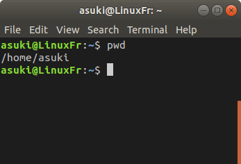

# 你好Linux！

> *"Hello world"* 是程序员在学习一门新的计算机语言时，最开始输出在屏幕上的内容。

_**这个部分是对Linux系统和Shell的简介**_ 

什么是 _**Linux**_ ? 它是被上千位开发者们建立的一个开源系统，我猜你经常使用的系统是Windows。不用担心，现在的Linux系统使用起来并不是那么的困难，我们使用的是Ubuntu —— 一个最受欢迎的Linux系统发行版，它基于Debian系统开发。

在最开始，你应该明白，桌面并不是你使用Linux的全部，即使Ubuntu拥有非常友善的UI交互方式，但通过 _**Shell**_ 依旧有许多非常方便且有用的使用方法。所以，不要依赖于桌面操作而更多的去使用Shell来帮助你更好的使用Ubuntu。当然，你可以选择任何你喜欢的Linux发行版本，而我们选择使用Ubuntu。

## Linux文件系统

在Linux下，所有的目录被组织成类似树根的结构，文件系统从**根目录** *(root directory)* 开始。根目录包含了所有的目录，根目录是非常重要的目录，所有的文件和目录都挂在在它的上面。

用户目录也是一个你需要知道的非常重要的目录，它是一个可以用来存放你私人文件的目录,我们有那么多的文件在Linux文件系统中，但你在最开始使用Linux系统的时候，应该知道表中所展示的目录。

**Linux文件系统目录索引表**

| 目录 | 描述 |
| :---      | :---                                               |
| /         | 根目录，是文件系统的第一层 |
| /home     | 用户目录，包含了文件和个人设置 |
| /usr      | 这是一个重要的目录，你所有的应用程序相关的内容都会放在其中，类似与Windows中的 "program file" |
| /etc      | 这个目录中包含了Linux系统文件和设置文件 |

Shell，如同它的名字“壳”一样，Shell就是Linux的外壳，Linux的核心被成为**内核** *(Kernel)*，Shell可以用来控制Linux系统并且反馈内核处理后的信息。如果你曾经使用过Windos下的Dos环境，你应该能非常轻松的在Linux中使用Shell。

在Ubuntu中，你可以使用**终端** *(Terminal)* 这个软件去运行Shell。我们将介绍一些使用Shell的小技巧。首先，你可以找到终端 *（通过应用软件中心或者使用快捷方式 “Ctrl+Alt+T”）* 然后输入：`pwd`

它将返回你当前的工作目录，如：

我们会向你展示更多例子来教你如何在终端使用命令：你可以自己建立一个文件夹如`mkdir` -- 只需要运行`mkdir test`，现在你就得到了一个名为test的目录文件了。

你可以使用`cd test`进入这个目录，你需要知道`.`表示当前目录，而`..`表示上一级目录，如果你想要回到上一级目录，你就需要在终端运行`cd ..`

如果你想知道更多命令，就在某个命令之前加上`man`，类似`man mkdir`，或者可以在某个命令之后加上`-h or -help`，你就可以看到来自开发者们的操作帮助了。

在 [下个部分](https://github.com/HDsky/Linux/blob/master/command.md), 你将看到一系列你会经常使用的命令。

## 参考资料
[1]http://blog.51cto.com/yangrong/1288072
[2]http://www.runoob.com/linux/linux-system-contents.html
[3]https://www.jianshu.com/p/4bdc5a6ebbee
